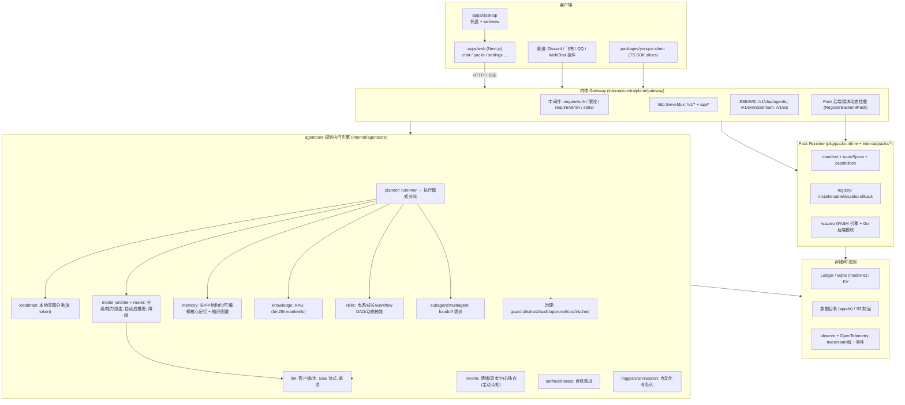
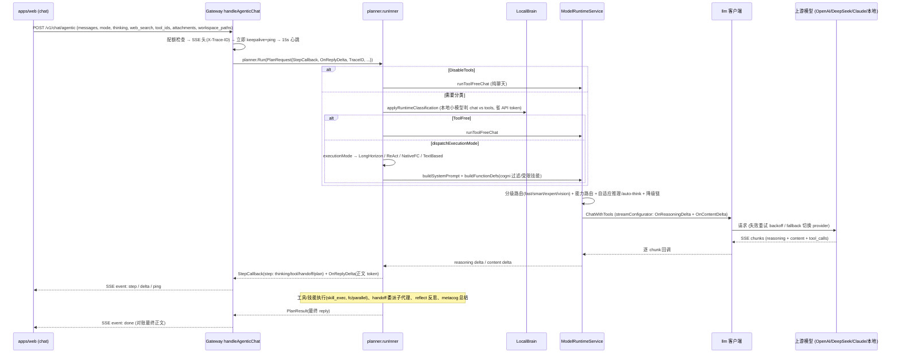

# 云雀 (Yunque / Tori) 架构总览

> 由 AI 探索代码库后生成的高层架构 + 数据流速览。模块名/路径均来自实际源码。
> 模块名 `yunque-agent`(Go 1.25),前端 `apps/web`(Next.js App Router),桌面 `apps/desktop`。

## 0. 一句话定位

一个 **AI 伴侣/智能体平台**:轻内核(身份/认证/registry/Pack Runtime/Ledger/最小 Gateway)+ 一个重型 `agentcore` 规划执行引擎 + 可热插拔的 **Pack** 生态(能力默认沉淀为可安装/启停/回滚的包)。

## 1. 分层架构

## 2. 启动与装配 (cmd/agent)

- 入口 `cmd/agent/main.go`:`supervisor`(进程守护/自愈)→ `loadConfig` → `newApp(cfg)` → `initGateway(app)`。
- 装配拆成大量 `init_*.go`:`init_llm`、`init_planner`、`init_memory`、`init_knowledge_wiring`、`init_channels`、`init_tasks`、`init_market`、`init_plugins`、`init_browser`、`init_training`、`init_orchestrator`、`init_gateway` 等(依赖注入式 wiring)。
- 其他二进制:`cmd/yunque`、`cmd/yunque-plugin`、`cmd/setup`、`cmd/doctor`、`cmd/bench`/`stress`/`perf-baseline`/`recall-eval`、`cmd/openapi-gen`、`cmd/cognisdk-*`。

## 3. 核心数据流:一次「智能体对话」

入口 `POST /v1/chat/agentic`(`handlers_agentic.go` → `handleAgenticChat`),SSE 流式。

SSE 事件类型:`ping`、`step`(thinking/tool_start/tool_result/reflect/handoff/plan)、`delta`(正文逐 token)、`done`、`error`。
前端 `apps/web/src/app/chat/page.tsx` 用 reducer(`UPDATE_LAST`)消费;`done` 时把正文对账成干净 `reply`。

## 4. 执行模式 (planner/execution_mode_dispatch.go)

`dispatchExecutionMode` 按 `executionMode(req)` 选择:

| 模式 | 函数 | 适用 |
| --- | --- | --- |
| `PlanExecutionLongHorizon` | `runLongHorizon` | 长程任务,产出**承诺式计划** `plan_snapshot`(前端进度面板逐项打勾) |
| `PlanExecutionReAct` | `runReAct` | ReAct 思考-行动循环 |
| `PlanExecutionNativeFC` | `runNativeFC` | 原生 function-calling |
| (default) | `runTextBased` | 文本协议解析工具调用 |

> 前端 `task-progress-panel.tsx` 的 `buildSteps` 优先级:承诺式计划 `plan_snapshot` > 委派 handoff > 直接工具实时清单。

## 5. 子系统速查 (internal/agentcore)

| 子系统 | 路径 | 职责 |
| --- | --- | --- |
| planner | `planner/` | 规划/执行循环/反思/metacog/long_horizon/skill_exec/delegation/model_runtime/prompt/context_window |
| llm | `llm/` | 模型客户端、provider 池、SSE 流式解析(`readSSEToolCalls`→`OnContentDelta`/`OnReasoningDelta`)、重试 |
| localbrain | `localbrain/` | 本地意图路由(naive bayes)、self-distill、LoRA adapter/scheduler/evaluator(端侧学习省 token) |
| router/adaptive | `router/`,`adaptive/` | 智能模型路由、自适应推理升档 |
| memory | `memory/` | 长/中/结构化记忆、可编辑核心记忆(记忆块)、extract/compact/conflict/dreams/orchestrator、召回 token 治理 |
| knowledge | `knowledge/` | RAG:bm25 / rerank / wiki / ingest |
| emotion + reverie | `emotion/`,`planner/reverie_events.go`,`planner/proactive_cognition_service.go`,`memory/dreams.go` | 情绪历史(emotion_shift)、事件驱动思考(task_failure_spike/high_value_fact)、内心独白、actions(write_memory/create_task/update_profile)、定时 loop |
| skills | `skillmarket/`,`skillgrowth/`,`workflow/` | 技能市场、从 web 源生成技能、技能成长、workflow DAG、动态技能审批 |
| subagent/multiagent | `subagent/`,`multiagent/` | handoff 委派(research/file_exec),`HandoffTimeoutForTool`=360s,supervisor |
| 治理/安全 | `guardrails/`,`trust/`,`audit/`,`approval/`,`costtrack/`,`tasksched/rlsched/` | 工具/关键词护栏、信任分、Merkle 审计、人审批、成本、RL 任务调度(qlearning) |
| 自愈/进化 | `selfheal/iterate/` | 改进提案/审批/迭代引擎 |
| 自动化 | `trigger/`,`cron/`,`session/` | 触发器 v2、cron、调度、任务队列 |
| 运行时 | `runtime/`(pool/heartbeat/circuit) | 资源池、心跳、熔断 |
| 交易 | `trading/`,`packs/trading/` | 行情/经纪/策略(示例垂直能力) |

## 6. Pack Runtime(热插拔能力)

设计见 `docs/spec/pack-runtime-blueprint.md`。原则:**轻内核 + 能力即包**。

- 清单:`pkg/packruntime/manifest.go`(backend/frontend/sdk/distribution/update + `routeSpecs` + `capabilities`)。
- 注册表:`pkg/packruntime/registry.go`(install/enable/disable/rollback/artifact 缓存/prune)。
- 后端模块:`RegisterBackendPack` → Gateway 统一挂载并做启停/清单/方法 gate 与冲突检测。
- 能力索引/解析/预检(只读、无副作用):`/v1/packs/capabilities`、`.../resolve`、`.../gate`、`.../plan`、`.../prepare`、`/v1/packs/catalog`、`/v1/packs/release-catalog`。
- 前端同步:`apps/web/src/lib/pack-sync.tsx` 从 enabled packs 生成菜单/路由/资源/SDK 绑定。
- WASM 引擎:`wazero`(`internal/packs/wasmplugin`、`wasmroute`)。
- 官方包(`packs/official/*` + `internal/packs/*`):lora、cogni-kernel、browser-intent、rpa-replay、chaos-probe、cognitive-canary、guardrail-fuzzer、memory-time-travel、sbom-drift、skill-anomaly、wasm-plugin、world-model、micro-agent、inner-life、night-school、backup。

## 7. 前端 (apps/web, Next.js App Router)

- ~56 个页面(`src/app/**/page.tsx`):`chat`、`packs/*`(含 `cognis`「我的助手」、`lora`、`browser`...)、`settings/*`、`memory`、`models`、`missions`、`dashboard`、`knowledge`、`skills`、`plugins`、`tools`、`approvals`、`audit`、`trust`、`workflows`、`bots`、`inbox`、`login`、`setup`、`ext/*`(airi/paper/qqchat)。
- API 客户端 `src/lib/api-core.ts`:HTTP 调用 + SSE/EventSource 消费 + 鉴权 token。
- 进度面板 `src/components/task-progress-panel.tsx`:Cursor 式计划清单。
- Pack 同步 `src/lib/pack-sync.tsx`:菜单/路由随后端 enabled packs 动态生成。

## 8. 桌面 (apps/desktop)

托盘 + webview 包裹 web 应用,含一键 dev 启动器、路径热更、webview 契约冒烟检查。

## 9. 存储与可观测

- `modernc.org/sqlite`(纯 Go)做 Ledger/KV;数据目录 `appdir`;`aws-sdk-go-v2/s3` 存制品。
- `internal/observe` + OpenTelemetry:`StartTrace`/span、`TraceID` 贯穿、统一事件协议、`AgentEvent`。

---
*提示:本文件由探索生成,可删除或加入 `.gitignore`。需要某个子系统的深入数据流(如 memory 召回、Pack 安装链路、LocalBrain 训练)可继续展开。*
